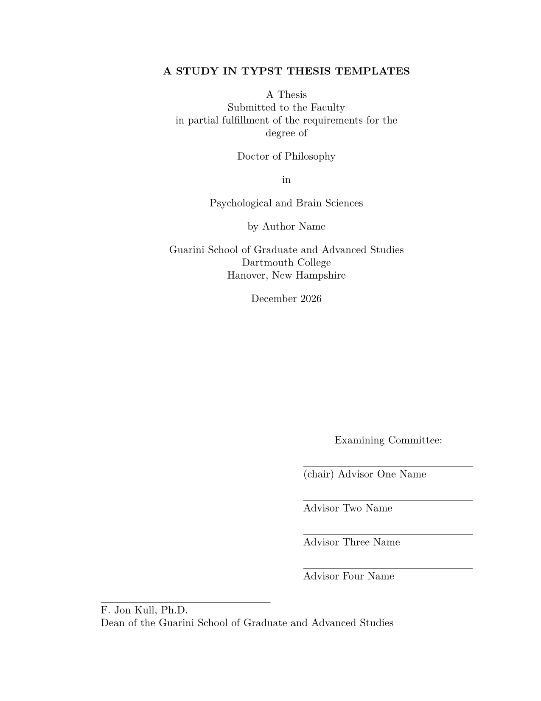
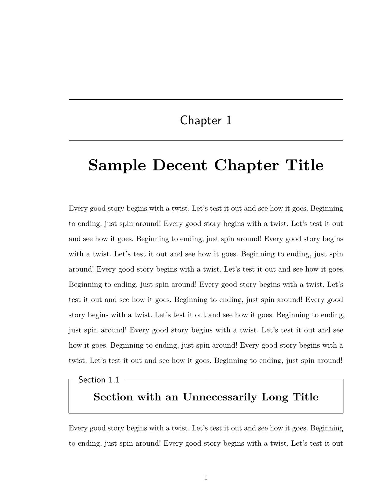

# Dartmouth Thesis Template (Typst)

A [Typst](https://typst.app/) template for PhD and Master's theses conforming to [Dartmouth College](https://graduate.dartmouth.edu/) Guarini School of Graduate and Advanced Studies formatting requirements.

|                  Title Page                   |                   Chapter Page                   |
| :-------------------------------------------: | :----------------------------------------------: |
|  |  |

## About

This Typst template recreates the formatting of the [Dartmouth PhD Thesis LaTeX template](https://www.overleaf.com/latex/templates/dartmouth-phd-thesis/hdztkxftnsmd) originally created by F. G. Dorais (2007), updated for 2017 guidelines by David Freund and Daryl DeFord, and later updated by Marek Svoboda (2021). Like the original, this template is distributed under the [LaTeX Project Public License](http://www.latex-project.org/lppl.txt) (LPPL).

The template supports:
- Standard PhD/Master's thesis title page format
- Engineering Sciences variant title page
- MALS (Master of Arts in Liberal Studies) variant title page
- Proper margin, font, and spacing requirements
- Roman numeral pagination for front matter
- Arabic numeral pagination for main content
- Chapter and section headers with automatic formatting
- Appendix support with letter numbering (A, B, C...)

**Important**: Formatting requirements may change. Always verify your thesis meets current Dartmouth Graduate School requirements before submission.

## Official Guidelines

- [Thesis Submission Information](https://graduate.dartmouth.edu/academics/graduate-registrar/information-submission-thesis-dissertation-or-course-track-fulfillments)
- [Thesis Formatting Guidelines (PDF)](https://graduate.dartmouth.edu/sites/graduate_studies.prod/files/graduate_studies/wysiwyg/thesis_guidelines_4.pdf)

## Usage

### Quick Start

1. Clone or download this repository
2. Edit `main.typ` with your thesis metadata (title, author, committee, etc.)
3. Add your chapters in `sections/`
4. Compile with Typst

### Compilation

Using the [Typst CLI](https://github.com/typst/typst):

```shell
typst compile --font-path fonts main.typ thesis.pdf
```

For continuous compilation during editing:

```shell
typst watch --font-path fonts main.typ thesis.pdf
```

## Fonts

This template uses [New Computer Modern](https://ctan.org/pkg/newcm) fonts, which are included in the `fonts/` directory. These fonts are distributed under the [GUST Font License](https://www.gust.org.pl/projects/e-foundry/licenses) (GFL), which is based on the LaTeX Project Public License.

The `--font-path fonts` flag tells Typst where to find the fonts. Alternatively, install them system-wide:
- **macOS**: Double-click each `.otf` file and click "Install Font"
- **Linux**: Copy fonts to `~/.local/share/fonts/` and run `fc-cache -fv`
- **Windows**: Right-click each `.otf` file and select "Install"

If fonts are installed system-wide, you can omit the `--font-path` flag.

**Download fonts**: If you need to obtain the fonts separately, download from [CTAN](https://www.ctan.org/pkg/newcomputermodern) or the [official release page](https://download.gnu.org.ua/release/newcm/).

## VS Code Setup

The included `VSCProject.code-workspace` file configures Visual Studio Code for Typst development:

1. Open VS Code
2. File → Open Workspace from File...
3. Select `VSCProject.code-workspace`

The workspace configures:
- [Tinymist](https://marketplace.visualstudio.com/items?itemName=myriad-dreamin.tinymist) as the Typst formatter and language server
- Typstyle formatting mode
- Word separators for better navigation in Typst files
- Spell checking with cSpell (ignores Typst-specific patterns)

**Recommended Extensions** (will be suggested when opening the workspace):
- [Tinymist Typst](https://marketplace.visualstudio.com/items?itemName=myriad-dreamin.tinymist) - Language server with live preview
- [Code Spell Checker](https://marketplace.visualstudio.com/items?itemName=streetsidesoftware.code-spell-checker) - Spell checking

To configure Tinymist to use the local fonts directory, add to your VS Code settings:

```json
"tinymist.fontPaths": ["fonts"]
```

## Template Parameters

The `dcthesis()` function in `dcthesis.typ` accepts these parameters:

### Document Metadata

| Parameter | Type | Description |
|-----------|------|-------------|
| `title` | content | Thesis title |
| `author` | string | Author name |
| `degree` | string | Degree type (default: "Doctor of Philosophy") |
| `field` | string | Field of study |
| `date` | string | Month and year of defense |

### Committee

| Parameter | Type | Description |
|-----------|------|-------------|
| `advisor` | content | Thesis advisor (chair) |
| `examiner-1` | content | Committee member 1 |
| `examiner-2` | content | Committee member 2 |
| `examiner-3` | content | Committee member 3 |
| `dean` | content | Dean name (default: "F. Jon Kull, Ph.D.") |
| `dean-title` | content | Dean title |

### Options

| Parameter | Type | Description |
|-----------|------|-------------|
| `variant` | string | Title page variant: "standard", "engineering", or "mals" |
| `copyright` | boolean | Include copyright page (default: false) |
| `copyright-name` | string | Name for copyright (defaults to author) |
| `copyright-year` | string | Year for copyright (defaults to current year) |

## Document Structure

```typst
#import "dcthesis.typ": *

#show: dcthesis.with(
  title: [Your Thesis Title],
  author: "Your Name",
  // ... other parameters
)

#frontmatter[
  = Abstract
  Your abstract here.

  = Preface
  Acknowledgments here.

  #outline(title: "Contents", indent: auto, depth: 3)
]

#mainmatter[
  #include "sections/ch-1.typ"
  #include "sections/ch-2.typ"

  #show: appendices
  #include "sections/supp-1.typ"
]

#backmatter[
  #bibliography("references.bib", style: "apa", title: "References")
]
```

## Per-Chapter Bibliographies

For theses requiring separate bibliographies at the end of each chapter (common for article-based dissertations), use the [alexandria](https://typst.app/universe/package/alexandria/) package.

Alexandria allows multiple independent bibliographies in a single document. Each chapter declares a unique prefix, and citations include that prefix to associate them with the correct bibliography.

```typst
#import "@preview/alexandria:0.2.2": *

// Chapter 1
#show: alexandria(prefix: "ch1:", read: path => read(path))

= Introduction

Discussion of prior work @ch1:smith2020 and theory @ch1:jones2019.

#bibliographyx("references.bib", prefix: "ch1:", title: "References")

// Chapter 2
#show: alexandria(prefix: "ch2:", read: path => read(path))

= Methods

Following established procedures @ch2:protocol2021.

#bibliographyx("references.bib", prefix: "ch2:", title: "References")
```

The `.bib` file uses standard keys (e.g., `smith2020`), but citations prepend the chapter prefix (e.g., `@ch1:smith2020`). The same entry can appear in multiple chapter bibliographies.

See the [alexandria documentation](https://typst.app/universe/package/alexandria/) for details on citation grouping, style options, and filtering.

## Requirements

- [Typst](https://typst.app/) v0.14.0 or later
  - Install via `brew install typst` (macOS) or see [installation guide](https://github.com/typst/typst#installation)
- New Computer Modern fonts (included in `fonts/` directory)

## Credits

- Original LaTeX template: F. G. Dorais (2007)
- 2017 guidelines update: David Freund and Daryl DeFord
- 2021 update: Marek Svoboda
- Typst implementation: Dae Houlihan

## Author

[](https://github.com/daeh) [](https://daeh.info) [](https://bsky.app/profile/dae.bsky.social)
