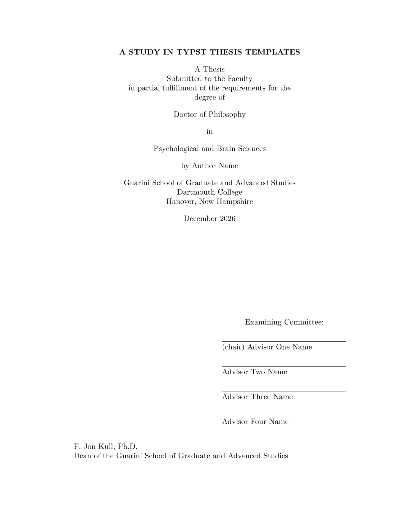
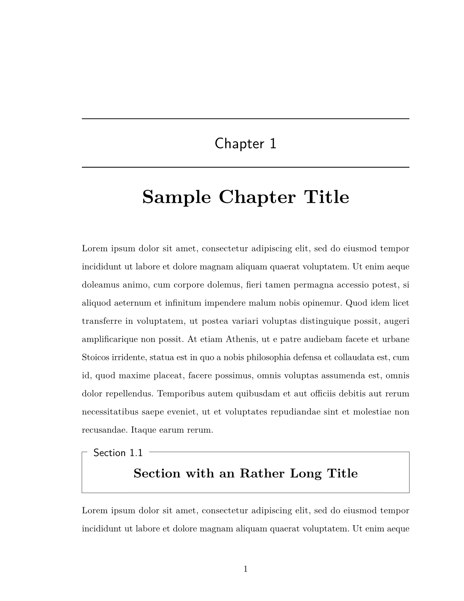

# Dartmouth Thesis Template (Typst)

A [Typst](https://typst.app/) template for PhD and Master's theses conforming to [Dartmouth College](https://graduate.dartmouth.edu/) Guarini School of Graduate and Advanced Studies formatting requirements.

|                 Title Page                 |                     Chapter Page                      |
| :----------------------------------------: | :---------------------------------------------------: |
|  |  |

## About

This Typst template recreates the formatting of the [Dartmouth PhD Thesis LaTeX template](https://www.overleaf.com/latex/templates/dartmouth-phd-thesis/hdztkxftnsmd) originally created by F. G. Dorais (2007), updated for 2017 guidelines by David Freund and Daryl DeFord, and later updated by Marek Svoboda (2021). Like the original, this template is distributed under the [LaTeX Project Public License](http://www.latex-project.org/lppl.txt) (LPPL).

The template supports the standard PhD/Master's thesis title page format. Engineering Sciences and MALS variants are not implemented.

**Important:** Formatting requirements may change. Always verify your thesis meets current Dartmouth Graduate School requirements before submission.

## Official Guidelines

- [Thesis Submission Information](https://graduate.dartmouth.edu/academics/graduate-registrar/information-submission-thesis-dissertation-or-course-track-fulfillments)
- [Thesis Formatting Guidelines (PDF)](https://graduate.dartmouth.edu/sites/graduate_studies.prod/files/graduate_studies/wysiwyg/thesis_guidelines_4.pdf)

## Template Files

- [`main.typ`](main.typ) — Typst entry point
- [`dcthesis.typ`](dcthesis.typ) — Template functions (page layout, headings, title page)
- [`references.bib`](references.bib) — Example BibLaTeX bibliography
- [`sections/`](sections/) — Chapter files included by `main.typ`
- [`utils/`](utils/) — Utilities
  - [`apa7.typ`](utils/apa7.typ) — APA 7th edition citation and reference style for [Pergamon](https://typst.app/universe/package/pergamon/)
  - [`refs.typ`](utils/refs.typ) — Bibliography section formatting and citation helpers
- [`data/`](data/) — External data files (e.g., participant counts read into the document)
- [`VSCProject.code-workspace`](VSCProject.code-workspace) — VS Code workspace configuration

Compiled output: [`_output/main.pdf`](_output/main.pdf)

## Template Parameters

The `dcthesis()` function accepts these parameters:

- **`thesis-title`** (content | string): Thesis title
- **`author`** (content | string): Author name
- **`degree`** (content | string): Degree type (default: "Doctor of Philosophy")
- **`field`** (content | string): Field of study
- **`date`** (content | string): Month and year of defense
- **`advisor`** (content | string): Thesis advisor (chair)
- **`examiner-1`** (content | string): Committee member 1
- **`examiner-2`** (content | string): Committee member 2
- **`examiner-3`** (content | string): Committee member 3
- **`dean`** (content | string): Dean name
- **`dean-title`** (content | string): Dean title

**Optional Parameters**

- **`copyright`** (dictionary): Copyright info with `year` and `name` keys (`name` defaults to `author`)
- **`hyphenate`** (boolean): Enable automatic hyphenation (default: true); set to false for easier proofreading
- **`draft`** (boolean): Enable draft mode (default: false)

## Local Usage

### VS Code Setup

If you're using Typst locally, the [Tinymist Typst VS Code Extension](https://marketplace.visualstudio.com/items?itemName=myriad-dreamin.tinymist) (the [Tinymist](https://myriad-dreamin.github.io/tinymist/) extension for [Visual Studio Code](https://code.visualstudio.com/)) provides an integrated language server with live preview, semantic highlighting, hover documentation, and linting.

The included `VSCProject.code-workspace` file offers a starter environment for working with Typst. To use it:

- Open `VSCProject.code-workspace` (or File → Open Workspace from File...)
- Accept the invitation to install the recommended extensions, which include
  - [Tinymist](https://marketplace.visualstudio.com/items?itemName=myriad-dreamin.tinymist)
  - [typstyle](https://typstyle-rs.github.io/typstyle/) for code formatting
  - [cSpell](https://cspell.org/) for basic spell checking
- Open `main.typ` and select `Typst Preview: Preview Opened File` from the VS Code command menu

### Fonts

This template requires [New Computer Modern](https://ctan.org/pkg/newcm) fonts. These are included in this repository in the [`fonts/`](fonts/) folder.

You can use these fonts for this project without installing them system wide by passing the `fonts` directory path to the Typst CLI (using `--font-path`) or Tinymist (using `tinymist.fontPaths`).

Alternatively, you can install the fonts system-wide:

<details>
  <summary>Install fonts system-wide</summary>
- **macOS**
  - If you have Homebrew installed, run `brew install font-new-computer-modern`
  - Or, drag the `.otf` files into the "Font Book" application
  - Or, double-click the `.otf` files and select "Install Font"
- **Linux**: Copy fonts to `~/.local/share/fonts/` and run `fc-cache -fv`
- **Windows**: Right-click the `.otf` files and select "Install"
</details>

The New Computer Modern fonts are distributed under the [GUST Font License](https://www.gust.org.pl/projects/e-foundry/licenses) (GFL). They are available for download from [CTAN](https://www.ctan.org/pkg/newcomputermodern) and the [official release page](https://download.gnu.org.ua/release/newcm/).

### Compilation

To compile a PDF using the [Typst CLI](https://github.com/typst/typst):

```shell
typst compile --font-path fonts --pdf-standard a-3u main.typ
```

If the required fonts are installed system-wide, you can omit `--font-path`. Otherwise, use `--font-path fonts` to specify the directory containing the OTF files. With the [Tinymist Typst VS Code Extension](https://marketplace.visualstudio.com/items?itemName=myriad-dreamin.tinymist), specify the font directory with the `tinymist.fontPaths` setting (see the Tinymist [documentation](https://myriad-dreamin.github.io/tinymist/config/vscode.html) for details).

Specifying a [PDF standard](https://typst.app/docs/reference/pdf/#pdf-standards) like `--pdf-standard a-3u` is optional but ensures that the PDF text is searchable and accessible.

For continuous compilation during editing, use watch mode:

```shell
typst watch --font-path fonts main.typ
```

If you're using the Tinymist extension, you can export a PDF from VS Code.

## Template Features

### Short Titles for Headers

When a heading is too long for the running header, use `short()` to provide an abbreviated version:

```typst
#import "dcthesis.typ": short

#short[Methods]
== Methodological Approaches to Investigating Complex Phenomena
```

The short title appears in the page header while the full title appears in the document body.

### Per-Chapter Bibliographies

This template uses [Pergamon](https://typst.app/universe/package/pergamon/) (v0.8.0) for bibliography management, which supports per-chapter bibliographies through `refsection`. Each chapter wraps its content in a `refsection` and ends with a `print-bibliography` call. Only the references cited within that chapter appear in its bibliography.

```typst
#import "/utils/apa7.typ": apa7-style, print-apa7-bibliography
#import "/utils/refs.typ": bib-section
#import "@preview/pergamon:0.8.0": *

#let style = apa7-style()

#refsection(style: style)[
  = My Chapter

  Some text with a citation #citep("smith2020").

  #bib-section[
    #print-apa7-bibliography(style)
  ]
]
```

Pergamon provides several citation convenience functions:

| Function | Form | Example output |
|----------|------|----------------|
| `#citep("key")` | Parenthetical | (Smith, 2020) |
| `#citet("key")` | Narrative | Smith (2020) |
| `#citeg("key")` | Possessive | Smith's (2020) |
| `#citename("key")` | Author only | Smith |
| `#citeyear("key")` | Year only | 2020 |
| `#citen("key")` | Bare | Smith, 2020 |

See [`sections/ch-2.typ`](sections/ch-2.typ) for a full working example.

Chapters that do not use citations (like [`sections/ch-1.typ`](sections/ch-1.typ)) do not need a `refsection` wrapper.

If you prefer a single global bibliography instead, you can replace the per-chapter setup with Typst's built-in `bibliography()` function in the backmatter. See the comments in [`main.typ`](main.typ) for details. Note that Typst's built-in bibliography and Pergamon cannot be used simultaneously.

## Requirements

- [Typst](https://typst.app/) v0.14.2 or later
  - NB the Tinymist extension packages Typst so you don't need to install Typst separately if you use Tinymist. (However, it is often useful to also have the Typst CLI installed.)
  - See the Typst [installation guide](https://github.com/typst/typst#installation)
    - (On macOS, you can install via [Homebrew](https://brew.sh/): `brew install typst`)
- [Pergamon](https://typst.app/universe/package/pergamon/) v0.8.0 (downloaded automatically by Typst on first compile)
- [New Computer Modern](https://ctan.org/pkg/newcm) fonts
  - Install system-wide or use the `.otf` files included in the [`fonts/`](fonts/) folder of this repository

## Credits

- Original LaTeX template ([Overleaf](https://www.overleaf.com/latex/templates/dartmouth-phd-thesis/hdztkxftnsmd))
  - F. G. Dorais (2007)
  - David Freund and Daryl DeFord: guidelines update (2017)
  - Marek Svoboda: update (2021)

## Author

[](https://github.com/daeh) [](https://daeh.info) [](https://bsky.app/profile/dae.bsky.social)
